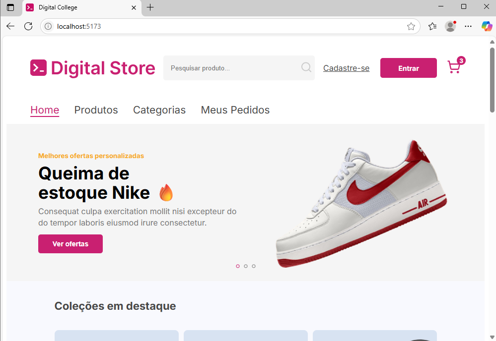

<p align="center">
  
</p>

<h1 align="center"> Digital Store — Projeto Frontend</h1>

<p align="center">
  <strong>Simulação de um e-commerce moderno desenvolvida em React.</strong>
</p>

---

## Sobre o Projeto

O **Digital Store** é um projeto acadêmico de front-end que simula um e-commerce com funcionalidades completas para navegação, listagem e visualização de produtos, gerenciamento de carrinho, histórico de pedidos e gestão de informações do usuário..

---

## Instalação e Execução

Siga os passos abaixo para rodar o projeto localmente:

1. **Clone o repositório:**
   ```bash
   git clone https://github.com/GabrielaNetoTech/projeto-final-frontend.git
   ```


2. **Instale as dependências:**
   ```bash
   npm install
   ```

3. **Execute a aplicação:**
   ```bash
   npm run dev
   ```

---

## 🗂️ Estrutura Completa do Projeto

```plaintext
├── 📁 node_modules/
├── 📁 public/
├── 📁 src/
│   ├── 📁 acoes/
│   │   └── products.js         
│   ├── 📁 api/
│   │   ├── products-variation.json
│   │   └── products.json
│   ├── 📁 assets/
│   ├── 📁 components/
│   │   ├── BuyBox.jsx
│   │   ├── CartContext.jsx
│   │   ├── FilterGroup.jsx
│   │   ├── Footer.jsx
│   │   ├── Gallery.jsx
│   │   ├── GalleryMini.jsx
│   │   ├── Header.jsx
│   │   ├── HeaderLogado.jsx
│   │   ├── InfoSection.jsx
│   │   ├── Logo.jsx
│   │   ├── MiniCart.jsx
│   │   ├── NotFound.jsx
│   │   ├── ProductCard.jsx
│   │   ├── ProductDetails.jsx
│   │   ├── ProductListing.jsx
│   │   ├── ProductOptions.jsx
│   │   ├── Produto.jsx
│   │   ├── ProtectedRoute.jsx
│   │   ├── Section.jsx
│   │   └── SegundoHeader.jsx
│   ├── 📁 contexts/
│   │   └── AuthContext.jsx
│   ├── 📁 layout/
│   │   ├── AuthLayout.jsx
│   │   ├── PageLayout.jsx
│   │   └── UserLayout.jsx
│   ├── 📁 pages/
│   │   ├── Cadastro.jsx
│   │   ├── Categorias.jsx
│   │   ├── FinalizarCompraPage.jsx
│   │   ├── FormsCadastro.jsx
│   │   ├── HomePage.jsx
│   │   ├── Login.jsx
│   │   ├── MeuCarrinho.jsx
│   │   ├── MeusPedidosPage.jsx
│   │   ├── MinhasInformacoesPage.jsx
│   │   ├── ProductListingPage.jsx
│   │   └── ProductViewPage.jsx
│   ├── 📁 Routes/
│   │   └── Paths.jsx
│   ├── App.jsx
│   ├── main.jsx
│   └── .gitignore
├── eslint.config.js
├── index.html
├── package-lock.json
├── package.json
├── README.md
└── vite.config.js
```

---

## 🗂️ Estrutura de Páginas

### E-commerce

- **HomePage.jsx** — Página inicial da loja
- **Categorias.jsx** — Exibição de categorias de produtos
- **ProductListingPage.jsx** — Listagem de produtos por categoria
- **ProductViewPage.jsx** — Detalhes individuais do produto

### Área do Usuário

- **MeuCarrinho.jsx** — Carrinho de compras
- **MeusPedidosPage.jsx** — Histórico de pedidos realizados
- **MinhasInformacoesPage.jsx** — Informações do usuário
- **FinalizarCompraPage.jsx** — Processo de finalização da compra

### Rotas

- **Routes/Paths.jsx** — Arquivo de configuração das rotas da aplicação

### Arquivos Principais

- **App.jsx** — Componente raiz da aplicação
- **main.jsx** — Ponto de entrada da aplicação

---

## Aviso sobre Autenticação

> **Atenção:** O sistema de login implementado neste projeto é de caráter **exclusivamente acadêmico e para fins de teste**. Não deve ser utilizado em ambientes de produção, pois não contempla as melhores práticas de segurança.

---

## Tecnologias e Dependências

O projeto utiliza as seguintes principais tecnologias e bibliotecas:

- [React](https://reactjs.org/) (`^19.1.0`)
- [React DOM](https://react.dev/) (`^19.1.0`)
- [React Router DOM](https://reactrouter.com/) (`^7.5.3`)
- [Styled-components](https://styled-components.com/) (`^6.1.18`)
- [Axios](https://axios-http.com/) (`^1.9.0`)
- [PrimeReact](https://primereact.org/) (`^10.9.5`)
- [PrimeFlex](https://www.primefaces.org/primeflex/) (`^4.0.0`)
- [PrimeIcons](https://www.primefaces.org/primeicons/) (`^7.0.0`)
- [React Icons](https://react-icons.github.io/react-icons/) (`^5.5.0`)
- [Boxicons](https://boxicons.com/) (`^2.1.4`)
- [Lucide React](https://lucide.dev/) (`^0.509.0`)
- [Node.js](https://nodejs.org/)
- [NPM](https://www.npmjs.com/)
- [Vite](https://vitejs.dev/) (opcional para desenvolvimento)

---

## 💡 Notas Importantes

- Certifique-se de ter o **Git** e o **Node.js** instalados em sua máquina.
- Recomenda-se utilizar uma versão do Node.js compatível para evitar conflitos de dependências.

---